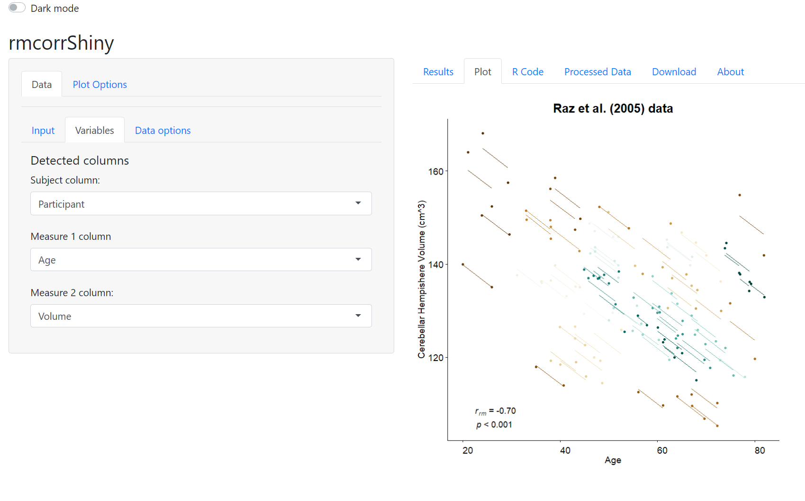

<!-- README.md is generated from README.Rmd. Please edit that file -->

[](https://travis-ci.org/lmarusich/rmcorr)
[](https://cran.r-project.org/package=rmcorr)
[](https://cran.r-project.org/package=rmcorr)
[](https://cran.r-project.org/package=rmcorr)

# rmcorr 

Repeated measures correlation (rmcorr) is a statistical technique for
determining the common within-individual association for paired measures
assessed on two or more occasions for multiple individuals.

## Installation

``` r
install.packages('rmcorr')

#development version:
# install.packages("devtools")
devtools::install_github("lmarusich/rmcorr")
```

## Example

``` r
library(rmcorr)
rmcorr(Subject, PaCO2, pH, bland1995)
#> Warning in rmcorr(Subject, PaCO2, pH, bland1995): 'Subject' coerced into a
#> factor
#> 
#> Repeated measures correlation
#> 
#> r
#> -0.5067697
#> 
#> degrees of freedom
#> 38
#> 
#> p-value
#> 0.0008471081
#> 
#> 95% confidence interval
#> -0.7112297 -0.223255
```

## Graphical Interface for rmcorr

A Shiny web and standalone app with a graphical user interface is also
available: <br>
<a href="https://lmarusich.shinyapps.io/shiny_rmcorr/">Web app</a> <br>
<a href="https://github.com/lmarusich/rmcorrShiny">Standalone app</a>


