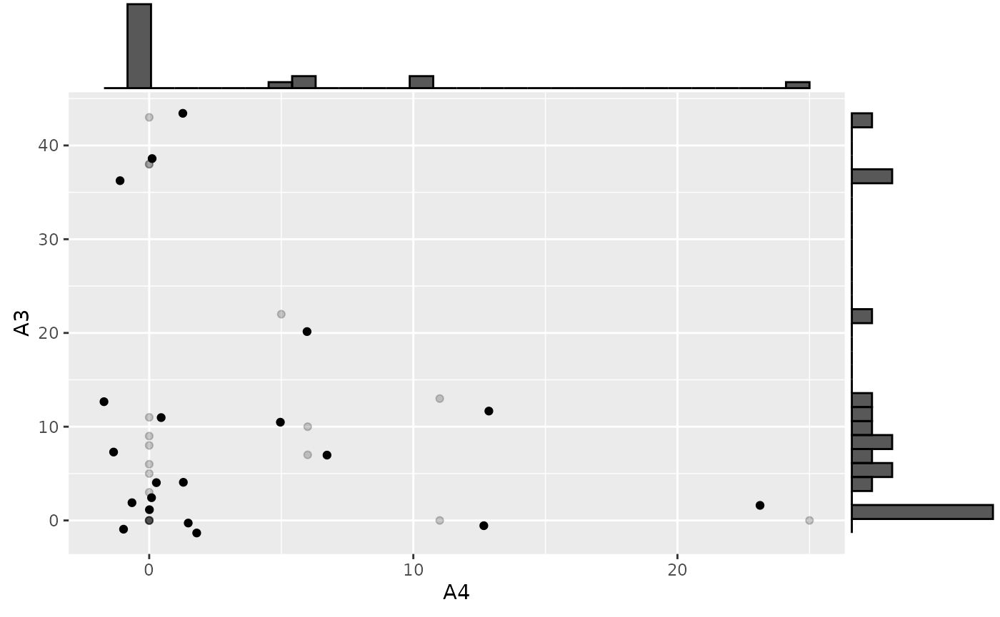
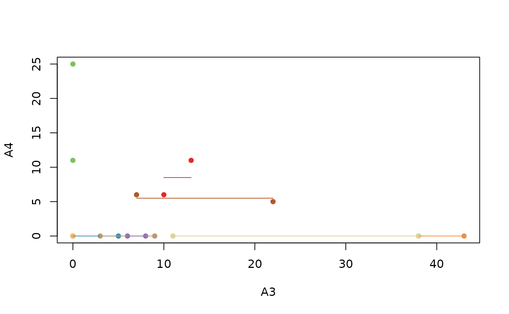
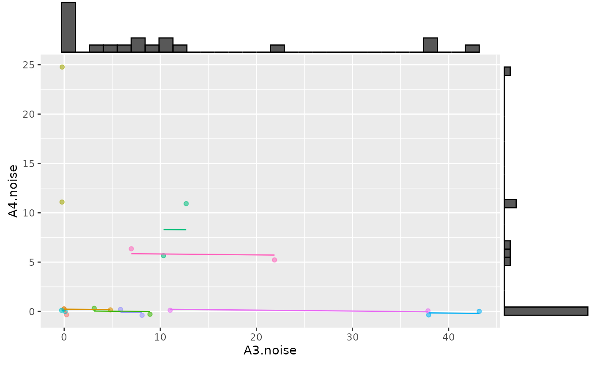

# rmcorr Estimates with NaN

### NaN estimates

This synthetic dataset produces NaN estimates with rmcorr. Thanks to
Shreya Ghosh for this example.

#### Running Examples Requires ggExtra (Attali and Baker 2022)

``` r
install.packages("ggExtra")
require(ggExtra)
```

#### Load data, visualize, and model

``` r
load(file = "../man/data/ghosh_synth.rda")

#Look at data
ghosh_synth #Note lots of repeated zeros in A3 and A4
#>    Subject TP  A1 A3 A4 A5  A6
#> 1        1  1   0  0  0 11   0
#> 2        1  2   0  0  0  3   0
#> 3        2  1   0  5  0  2   0
#> 4        2  2   0  0  0 16   0
#> 5        3  1  72  0 11  0   0
#> 6        3  2 161  0 25  0   0
#> 7        4  1  54  9  0 10   0
#> 8        4  2  30  3  0  2   0
#> 9        5  1   0 10  6  0  33
#> 10       5  2   0 13 11  0 106
#> 11       6  1   0  0  0  0   0
#> 12       6  2   0  0  0  0   0
#> 13       7  1   0 43  0  8   0
#> 14       7  2   0 38  0 18   0
#> 15       8  1   8  8  0  0   0
#> 16       8  2   0  6  0  0  45
#> 17       9  1   0 38  0  0  48
#> 18       9  2   0 11  0  0  99
#> 19      10  1  28 22  5  0   0
#> 20      10  2   0  7  6  0 151

set.seed(40) #Make jittering reproducible 
p <- ggplot(ghosh_synth, aes(x = A4, y = A3)) +
            geom_point(alpha = 0.2) +
            geom_jitter(width = 2, height = 2) 
p1 <- ggMarginal(p, type="histogram")
p1
```



``` r

rmc.ghosh <- rmcorr(Subject, A3, A4, ghosh_synth)
#> Warning in rmcorr(Subject, A3, A4, ghosh_synth): 'Subject' coerced into a
#> factor

rmc.ghosh
#> 
#> Repeated measures correlation
#> 
#> r
#> 0
#> 
#> degrees of freedom
#> 9
#> 
#> p-value
#> 1
#> 
#> 95% confidence interval
#> -0.599875 0.599875

#The default rmcorr plot doesn't jitter values, this masks identical values because they are drawn on top of each other
plot(rmc.ghosh)
```



The NaN estimates appear to be due to insufficient varability in the
dataset. A possible way to address this issue is adding a small amount
of random noise.

#### Add random noise

``` r
set.seed(67) 
small.noise1 <- rnorm(dim(ghosh_synth)[[1]], 0, 0.2)
small.noise2 <- rnorm(dim(ghosh_synth)[[1]], 0, 0.2)
    
ghosh_synth$A3.noise <- ghosh_synth$A3 + small.noise1
ghosh_synth$A4.noise <- ghosh_synth$A4 + small.noise2

rmc.ghosh.noise <- rmcorr(Subject, A3.noise, A4.noise, ghosh_synth)
#> Warning in rmcorr(Subject, A3.noise, A4.noise, ghosh_synth): 'Subject' coerced
#> into a factor

rmc.ghosh.noise
#> 
#> Repeated measures correlation
#> 
#> r
#> -0.02006963
#> 
#> degrees of freedom
#> 9
#> 
#> p-value
#> 0.9532957
#> 
#> 95% confidence interval
#> -0.6125697 0.5868709

p2 <- ggplot(ghosh_synth, aes(x = A3.noise, y = A4.noise, 
       group = factor(Subject), color = factor(Subject))) +
       ggplot2::geom_point(ggplot2::aes(colour = factor(Subject), 
                                        alpha = 0.10)) +
       ggplot2::geom_line(aes(y = rmc.ghosh.noise$model$fitted.values),
                         linetype = 1) +
     theme(legend.position="none")

p3 <- ggMarginal(p2, type="histogram")
p3
```



#### Caveats

The results with rmcorr should be interpreted with some caution because
the data are non-normal with zero-inflation. Still, these results
provides at least a starting point: A common linear association around
0. A much more complicated alternative is fitting a multilevel model
with an appropriate distribution for zero-inflated data (e.g., negative
binomial distribution or zero-inflated Poisson).

Attali, Dean, and Christopher Baker. 2022. *ggExtra: Add Marginal
Histograms to ’Ggplot2’, and More ’Ggplot2’ Enhancements*.
<https://CRAN.R-project.org/package=ggExtra>.
