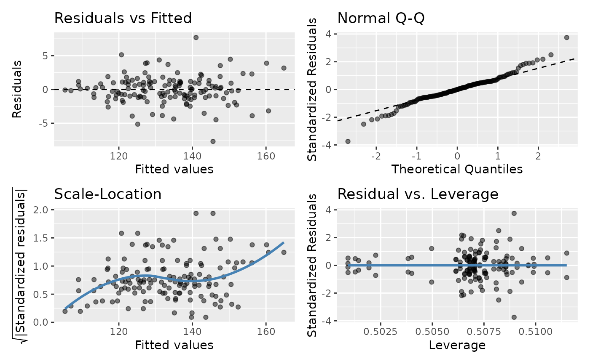

# Diagnostic Plots

#### Running Example Requires gglm (White 2023)

``` r
#Install gglm
install.packages("gglm")
require(gglm)
```

## Plotting Model Diagnostics

The code below demonstrates how to plot model diagnostics for *rmcorr*.
There are four diagnostic plots assessing:  
1. Residuals vs. Fitted values: Linearity  
2. Quantile-Quantile (Q-Q): Normality of residuals  
3. Scale-Location: Equality of variance (homoscedasticity)  
4. Residuals vs. Leverage: Influential observations

``` r
raz.rmc <- rmcorr(participant = Participant, measure1 = Age, 
                  measure2 = Volume, dataset = raz2005) 
#> Warning in rmcorr(participant = Participant, measure1 = Age, measure2 = Volume,
#> : 'Participant' coerced into a factor

#Using gglm
 gglm(raz.rmc$model)
#> Warning: `fortify(<lm>)` was deprecated in ggplot2 4.0.0.
#> ℹ Please use `broom::augment(<lm>)` instead.
#> ℹ The deprecated feature was likely used in the ggplot2 package.
#>   Please report the issue at <https://github.com/tidyverse/ggplot2/issues>.
#> This warning is displayed once per session.
#> Call `lifecycle::last_lifecycle_warnings()` to see where this warning was
#> generated.
```



``` r

#using base R 
#plot(raz.rmc$model)
```

How much do violations of these assumptions matter? It depends. General
Linear Model (GLM) is typically robust to deviations from the above
assumptions, but severe violations may produce misleading results
(Gelman, Hill, and Vehtari 2020). Also, the reason(s) for violations can
matter: “Violations of assumptions may result from problems in the
dataset, the use of an incorrect regression model, or both” (Cohen et
al. 2013, 117).

Cohen, Jacob, Patricia Cohen, Stephen G West, and Leona S Aiken. 2013.
*Applied Multiple Regression/Correlation Analysis for the Behavioral
Sciences*. Routledge.

Gelman, Andrew, Jennifer Hill, and Aki Vehtari. 2020. *Regression and
Other Stories*. Cambridge University Press.

White, Grayson. 2023. *Gglm: Grammar of Graphics for Linear Model
Diagnostic Plots*. <https://CRAN.R-project.org/package=gglm>.
