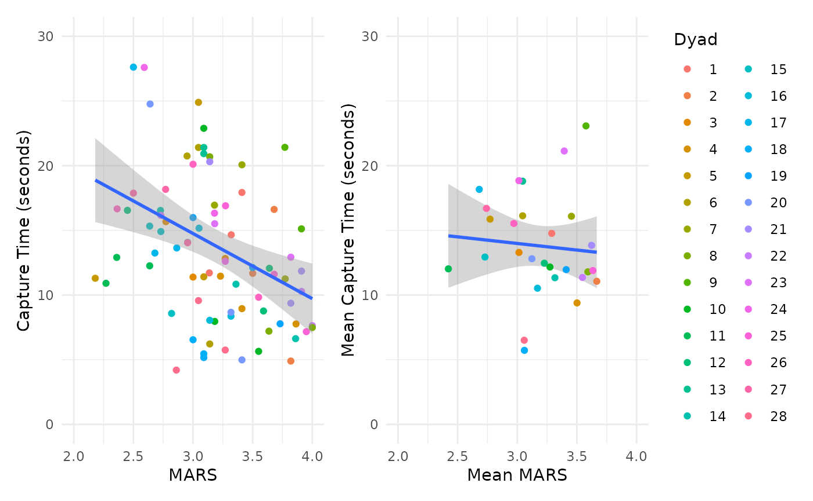
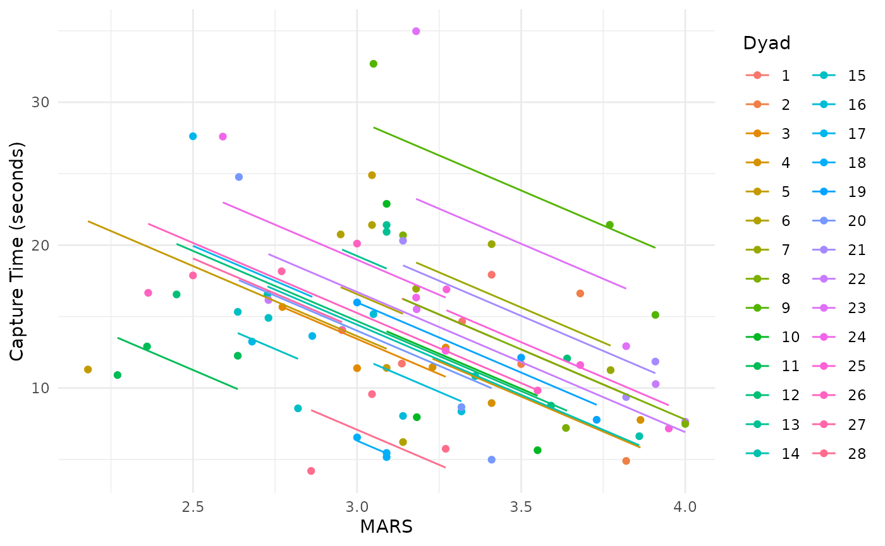
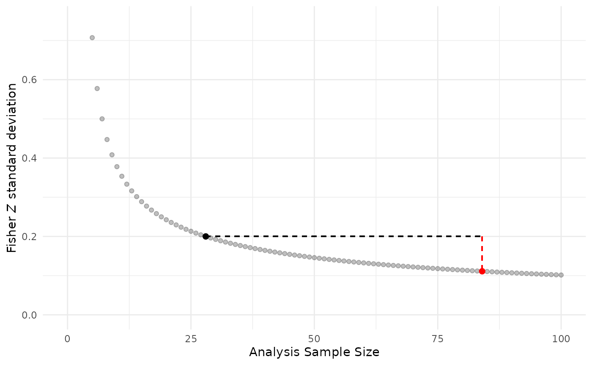

# Overfitting/Pseudoreplication

### Overfitting/Pseudoreplication

In this vignette, we demonstrate the potential consequences of a
statistical analysis that ignores dependencies in data. Such overfitting
may produce **misestimated effect sizes with suppressed variability
leading to underestimated *p*-values**. This phenomenon is also widely
referred to as **pseudoreplication** (Hurlbert 1984; Lazic 2010; Eisner
2021) or a “unit of analysis error” (Hurlbert 2009). For an accessible
introduction to this topic see Reinhart (2015)

This is a simplified illustration of the consequences for
overfitting/pseudoreplication, it is not comprehensive. Overfitting is
not limited to simple regression/correlation and there are multiple
types of pseudoreplication including data collected over space and time
(Hurlbert 1984, 2009).

#### Running Code Below Requires: dplyr, esc, and patchwork

``` r
install.packages("dplyr")
require(dplyr)

install.packages("esc")
require(esc)

install.packages("patchwork")
require(patchwork)
```

#### Example of Overfitting

We illustrate the consequences of overfitting/pseudoreplication using
our [data](../reference/marusich2016_exp2.md) from Marusich et al.
(2016). This dataset has a sample size of *N* = 28 dyads (two
participants working together), where each dyad has *k* = 3 repeated
measures of two variables: a total of 84 paired observations (*N* x
*k*). The two measured variables were scores on the Mission Awareness
Rating Scale (MARS) and target-capture time, both assessed in three
separate experimental blocks.

Repeated measures correlation is a technique for assessing the
within-subject (in this example, within-dyad) relationship between two
variables; for example, does a dyad tend to demonstrate higher awareness
scores in blocks where it also generates faster target-capture times?
Sometimes, however, the relevant research question is about
between-subject (dyad) associations; for example, do dyads who tend to
perform better on one variable also tend to perform better on the other?
To answer this second question, it may be tempting to treat the repeated
measures data as independent. Below we demonstrate the potential
consequences of this approach.

In the left figure, we fit a simple regression/correlation improperly
treating the 84 total observations as independent units of analysis. In
the right figure, we demonstrate one approach to analyzing the between
(dyad) relationship without overfitting: averaging the data by the unit
of analysis (dyad). Note this approach removes all *within (dyad)
information*.

The x-axis depicts scores on the Mission Awareness Rating Scale (MARS),
with higher values representing better situation awareness. The y-axis
is target-capture times, the time in seconds to capture High Value
Targets (HVT) during the task. Smaller values (faster times) represent
better task performance. The band around each regression line is a 95%
confidence interval.

``` r
overfit.plot <- 
    ggplot(data = marusich2016_exp2, aes(x = MARS, y = HVT_capture)) +
    geom_point(aes(colour = factor(Pair))) +
    geom_smooth(method= "lm", level = 0.95) +
    coord_cartesian(xlim = c(2,4), ylim=c(0,30)) + 
    ylab("Capture Time (seconds)") + 
    theme_minimal() +
    theme(legend.position="none") 

marusich2016_avg <- marusich2016_exp2 %>%
                    group_by(Pair) %>%
                    summarize(Mean_MARS = mean(MARS),
                              Mean_HVT_capture = mean(HVT_capture))

average.plot <- 
    ggplot(data = marusich2016_avg, 
           aes(x = Mean_MARS, y = Mean_HVT_capture)) +
    geom_smooth(fullrange = TRUE, method= "lm", level = 0.95) +
    coord_cartesian(xlim = c(2,4), ylim=c(0,30)) +
    geom_point(aes(colour = factor(Pair))) +
    xlab("Mean MARS") +
    ylab("Mean Capture Time (seconds)") +
    scale_colour_discrete(name = "Dyad") +
    theme_minimal()

overfit.cor <- cor.test(marusich2016_exp2$MARS, marusich2016_exp2$HVT_capture)

average.cor <- cor.test(marusich2016_avg$Mean_MARS, marusich2016_avg$Mean_HVT_capture)

df.s <- rbind(overfit.cor$parameter, average.cor$parameter)

r.s  <- rbind(round(rbind(overfit.cor$estimate, average.cor$estimate), digits = 2)) 

CI.s <- formatC(rbind(overfit.cor$conf.int, 
          average.cor$conf.int), digits = 2,
          format = 'f')

p.vals <- rbind(round(overfit.cor$p.value, digits = 3), 
                prettyNum(average.cor$p.value, digits = 2, 
                          drop0trailing = TRUE))

overfit.plot + average.plot 
#> `geom_smooth()` using formula = 'y ~ x'
#> `geom_smooth()` using formula = 'y ~ x'
```



The inferential statistics for the above plots are:

Overfit (left): *r(82)* = -0.35, 95% CI \[-0.53, -0.15\], *p* = 0.001
(Exact *p*-value = 0.0010208)

Average (right): *r(26)* = -0.09, 95% CI \[-0.44, 0.30\], *p* = 0.67
(Exact *p*-value = 0.6663228)

For the overfit results, note the Pearson correlation has 82 degrees of
freedom which is excessive because it implies a sample size of *N* = 84
dyads (*N* - 2 degrees of freedom for a correlation (Cohen et al.
2013)). That is, the actual sample size (*N* = 28 dyads) is erroneously
modeled as **84 independent units** by ignoring the three paired,
repeated measures per dyad.

These two analyses produce varied results. The overfit model erroneously
produces a precise moderate, negative correlation for higher MARS values
being associated with lower times to capture targets (better
performance). In contrast, the average model indicates a weak negative
correlation with high uncertainty between dyads.

##### Comparison to rmcorr

As a comparison, we show the results of conducting a repeated measures
correlation analysis on the same dataset. As described above, this
method addresses a different question of the nature of the within-dyad
relationship, rather than between dyads. In this analysis, averaging is
not required, as the dependencies in the data are taken into account.

``` r
marusich.rmc <- rmcorr(participant = Pair, 
                       measure1 = MARS, 
                       measure2 = HVT_capture, 
                       data = marusich2016_exp2)
#> Warning in rmcorr(participant = Pair, measure1 = MARS, measure2 = HVT_capture,
#> : 'Pair' coerced into a factor
rmc.plot <- 
    ggplot(data = marusich2016_exp2, 
           aes(x = MARS, y = HVT_capture, group = factor(Pair), color = factor(Pair))) +
    geom_point(aes(colour = factor(Pair))) +
    geom_line(aes(y = marusich.rmc$model$fitted.values)) +
    theme_minimal() +
    scale_colour_discrete(name = "Dyad") +
    ylab("Capture Time (seconds)")

rmc.r <- round(marusich.rmc$r, 2)
rmc.CI <- round(marusich.rmc$CI, 2)
rmc.p <- formatC(marusich.rmc$p, format = "fg", digits = 2)
                # prettyNum(average.cor$p.value, digits = 2,
                          # drop0trailing = TRUE))

rmc.plot
```



The inferential statistics for the rmcorr analysis are:

*r_(rmcorr)(55)* = -0.59, 95% CI \[-0.74, -0.39\], *p* = 0.0000014.

###### Levels of Analysis

The above analysis indicates a strong *within-dyad* or relative
relationship for the two measures. At the within level of analysis,
higher values of MARS have a large to very large relative (within-dyad)
association with better performance, lower target capture times; and
vice-versa. However, the dyad-to-dyad comparisons for MARS or
performance values are only weakly predictive at the between level of
analysis. In other words, using a specific MARS (or performance) value
to predict the other is quite limited between the dyads. Results at the
between level of analysis may not necessarily generalize to the within
level of analysis (Curran and Bauer 2011; Fisher, Medaglia, and
Jeronimus 2018; Molenaar and Campbell 2009)

##### Consequences of Overfitting:

1.  Misestimated effect size: The overfit analysis has an approximately
    point-estimated medium negative correlation, whereas the averaged
    analysis has slightly less than a small negative point-estimated
    correlation.

2.  Spurious precision: The coverage of the confidence intervals
    (visually on the plot and matching inferential statistics) is
    narrower than it should be for the overfit analysis compared to the
    averaged data.

3.  Suppressed *p*-value: Because overfitting produces a medium negative
    effect size and underestimates variance, the overfit example is
    highly statistically significant.

#### Spurious Precision: Underestimation of Variability

To compare the suppression of variability with the overfit model versus
a correct model, we use the Fisher *Z* approximation for the standard
deviation (sd) is: $$\frac{1}{\sqrt{N - 3}}$$ This formula is calculated
using the respective sample sizes for each model *N* = 84 (overfit) and
*N* = 28 (correct).

``` r
N.vals <- seq(5, 100, by = 1)
sd.Z <- 1/sqrt(N.vals-3)

sd.overfit <- data.frame(cbind(N.vals, sd.Z))

sd.cor <- sd.Z[N.Marusich2016-4] #Have to subtract 4 because N.vals starts at 5, not 1
sd.overf <- sd.Z[total.obs.Marusich2016-4]

#We could determine the inflated sample size for the overfit model using its degrees of freedom + 2
df.s + 2  == total.obs.Marusich2016
#>         df
#> [1,]  TRUE
#> [2,] FALSE

sd.overfit.plot <- 
    ggplot(data = sd.overfit, 
           aes(x = N.vals, y = sd.Z)) +
    coord_cartesian(xlim = c(0,100), ylim=c(0, 0.75)) +
    geom_point(alpha = 0.25) +
    geom_segment(x = 28, y =  sd.cor, xend = 84, 
                 yend =  sd.cor, linetype = 2) +
    geom_segment(x = 84, y =  sd.cor, xend = 84, 
                 yend =  sd.overf, colour = "red",
                 linetype = 2) +
    xlab("Analysis Sample Size") + 
    ylab(expression(paste("Fisher ", italic("Z"), " standard deviation"))) +
    annotate(geom = "point", x = 28, y = sd.cor, 
             colour = "black", size = 2) +
    annotate(geom = "point", x = 84, y = sd.overf, 
             colour = "red", size = 2) +
    theme_minimal()

sd.overfit.plot
```



In the graph, the red dot indicates the overfit model and black dot
shows a correct model with averaged data. Note the magnitude of sd
underestimation with pseudoreplication is depicted by the dashed
vertical red line: the Fisher *Z* *sd* = 0.11 for the overfit model is
about half the value of a correct model Fisher *Z* *sd* = 0.20.

#### Detecting Overfitting

The easiest way to detect overfitting is comparing the the sample size
(degrees of freedom) in statistical results to the actual sample size,
as shown above.

However, if degrees of freedom for reported results are unavailable it
may still be possible to detect overfitting. For example, the actual
sample size *N* and reported (ideally exact) *p*-value can be used to
calculate their corresponding expected effect size. Then, the expected
effect and reported effect can be compared.

We demonstrate this using the *esc* package (Lüdecke 2019) to determine
the expected correlation (Fisher *Z*) for an actual sample size of *N* =
28 with a reported *p-value (exact)* = 0.0010208 from the overfit
analysis. We perform the Fisher *Z*-to-*r* transformation, using the
*psych* package (William Revelle 2024), to compare the values of the
expected correlation versus the reported correlation.

``` r
#Calculate the expected correlation using the reported p-value and actual sample size 
#esc_t assumes p-value is two-tailed and uses a Fisher Z transformation
calc.z <- esc_t(p = as.numeric(p.vals[1]), 
                      totaln = N.Marusich2016, 
                      es.type = "r")$es


reported.r = as.numeric(r.s[1])

#Overfit?
fisherz2r(calc.z) != abs(reported.r)  
#> [1] TRUE
#Note calc.z will always be positive using esc_t() this way
#If the reported.r is not a Fisher Z value - either it should be transformed or the calc.z should be transformed

fisherz2r(calc.z) 
#> [1] 0.5284473
reported.r
#> [1] -0.35
```

See the last code chunk in this R Markdown document for examples of
detecting overfit correlations from results reported in published papers
(<https://osf.io/cnfjt>) from a systematic review and meta-analysis
(Bakdash et al. 2022).

##### Caveats

Detection of overfitting should be used with caution because mismatches
in reported versus expected values could be due to missing or excluded
data in the reported statistics. Missing data can produce a lower sample
size (based on the reported statistics) than the actual sample size; as
opposed to an inflated sample size with true pseudoreplication.

Additionally, overfit models can be adjusted or penalized to account for
dependencies in data. Examples of such techniques include cluster-robust
errors, regularization, and ensemble models.

Last, we contend there **may** be some circumstances where overfitting
is acceptable (e.g., exploratory data analysis including visualization,
separate models for each participant with a large number of repeated
trials \[such as psychophysics\], or no meaningful difference between
the overfit model without and with adjustment techniques).

#### Prevelance of Pseudoreplication

The prevalence of overfitting/pseudoreplication in published papers
suggest it is a frequent statistical error across disciplines. For
results reported in a single issue of the journal *Nature Neuroscience*
36% of papers had one or more results with suspected overfitting and 12%
of papers had definitive evidence of pseudoreplication (Lazic 2010). In
human factors, using only results meeting inclusion for a systematic
review, overfitting was found in 28% of papers: 29 out of
103[¹](#fn1)(Bakdash et al. 2022).

Bakdash, Jonathan Z, Laura R Marusich, Katherine R Cox, Michael N Geuss,
Erin G Zaroukian, and Katelyn M Morris. 2022. “The Validity of Situation
Awareness for Performance: A Meta-Analysis.” *Theoretical Issues in
Ergonomics Science* 23 (2): 221–44.
<https://doi.org/10.1080/1463922X.2021.1921310>.

Cohen, Jacob, Patricia Cohen, Stephen G West, and Leona S Aiken. 2013.
*Applied Multiple Regression/Correlation Analysis for the Behavioral
Sciences*. Routledge.

Curran, Patrick J, and Daniel J Bauer. 2011. “The Disaggregation of
Within-Person and Between-Person Effects in Longitudinal Models of
Change.” *Annual Review of Psychology* 62 (1): 583–619.
<https://doi.org/10.1146/annurev.psych.093008.100356>.

Eisner, David A. 2021. “Pseudoreplication in Physiology: More Means
Less.” *Journal of General Physiology* 153 (2).
<https://doi.org/10.1085/jgp.202012826>.

Fisher, Aaron J, John D Medaglia, and Bertus F Jeronimus. 2018. “Lack of
Group-to-Individual Generalizability Is a Threat to Human Subjects
Research.” *Proceedings of the National Academy of Sciences* 115 (27):
E6106–15. <https://doi.org/10.1073/pnas.1711978115>.

Hurlbert, Stuart H. 1984. “Pseudoreplication and the Design of
Ecological Field Experiments.” *Ecological Monographs* 54 (2): 187–211.
<https://doi.org/10.2307/1942661>.

———. 2009. “The Ancient Black Art and Transdisciplinary Extent of
Pseudoreplication.” *Journal of Comparative Psychology* 123 (4): 434.
<https://doi.org/10.1037/a0016221>.

Lazic, Stanley E. 2010. “The Problem of Pseudoreplication in
Neuroscientific Studies: Is It Affecting Your Analysis?” *BMC
Neuroscience* 11: 1–17. <https://doi.org/10.1186/1471-2202-11-5>.

Lüdecke, Daniel. 2019. *Esc: Effect Size Computation for Meta Analysis
(Version 0.5.1)*. <https://doi.org/10.5281/zenodo.1249218>.

Marusich, Laura R, Jonathan Z Bakdash, Emrah Onal, Michael S Yu, James
Schaffer, John O’Donovan, Tobias Höllerer, Norbou Buchler, and Cleotilde
Gonzalez. 2016. “Effects of Information Availability on
Command-and-Control Decision Making: Performance, Trust, and Situation
Awareness.” *Human Factors* 58 (2): 301–21.
<https://doi.org/10.1177/0018720815619515>.

Molenaar, Peter CM, and Cynthia G Campbell. 2009. “The New
Person-Specific Paradigm in Psychology.” *Current Directions in
Psychological Science* 18 (2): 112–17.
<https://doi.org/10.1111/j.1467-8721.2009.01619.x>.

Reinhart, Alex. 2015. *Statistics Done Wrong: The Woefully Complete
Guide*. No Starch Press.

William Revelle. 2024. *Psych: Procedures for Psychological,
Psychometric, and Personality Research*. Evanston, Illinois:
Northwestern University. <https://CRAN.R-project.org/package=psych>.

------------------------------------------------------------------------

1.  26 papers had all overfit results and 3 papers had partial results
    with overfitting. This calculation had 103 total papers = 74 (no
    overfitting) + 3 (partial overfitting) + 26 (all overfitting).
