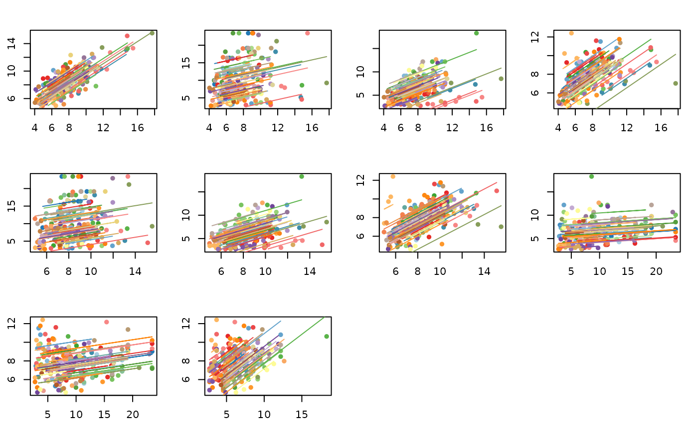
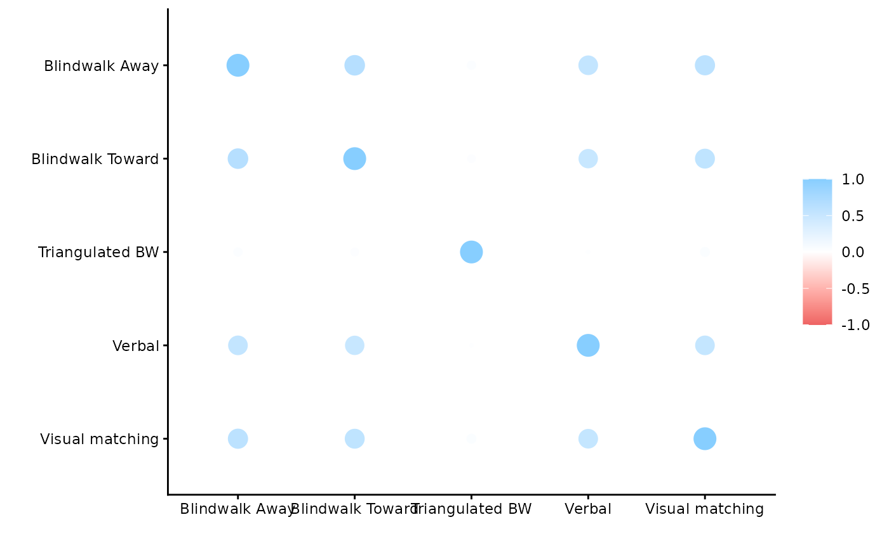

# Correlation Matrix using rmcorr_mat

#### Running Examples Requires corrplot (Wei and Simko 2021) and corrr (Kuhn, Jackson, and Cimentada 2025)

``` r
#Install corrplot and corrr
 install.packages("corrplot")
 install.packages("corrr")
 require(corrplot)
 require(corrr)
```

## Plotting a Correlation Matrix

The output from *rmcorr_mat* can be used be used to plot a correlation
matrix.

``` r
dist_rmc_mat <- rmcorr_mat(participant = Subject, 
                           variables = c("Blindwalk Away",
                                         "Blindwalk Toward",
                                         "Triangulated BW",
                                         "Verbal",
                                         "Visual matching"),
                           dataset = twedt_dist_measures,
                           CI.level = 0.95)

corrplot(dist_rmc_mat$matrix)
```


## Plotting Multiple Models

The output can also be used to plot multiple models side-by-side.

``` r
#Number of models being plotted
n.models <- length(dist_rmc_mat$models)

#Change graphing parameters to plot side-by-side
#with narrower margins
par(mfrow = c(3,4), 
    mar = c(2.75, 2.4, 2.4, 1.4))

for (i in 1:n.models) {
    plot(dist_rmc_mat$models[[i]])
    }

#Reset graphing parameters
#dev.off()
```



## Adjusting for Multiple Comparisons

The third component of the output from *rmcorr_mat()* contains a summary
of results. Using the summary component, we demonstrate adjusting for
multiple comparisons using two methods: the Bonferroni correction and
the False Discovery Rate (FDR).  
  
This example also compares the unadjusted *p*-values to both adjustment
methods. Because most of the unadjusted *p*-values are quite small, many
of the adjusted *p*-values tend to be similar to the unadjusted ones and
the two adjustment methods also tend to produce similar *p*-values.

``` r
#Third component: Summary
dist_rmc_mat$summary
#>            measure1         measure2  df  rmcorr.r    lowerCI   upperCI
#> 1    Blindwalk Away Blindwalk Toward 175 0.8065821 0.74808182 0.8526427
#> 2    Blindwalk Away  Triangulated BW 174 0.2382857 0.09366711 0.3730565
#> 3    Blindwalk Away           Verbal 175 0.7355813 0.65965209 0.7966468
#> 4    Blindwalk Away  Visual matching 174 0.7758245 0.70930425 0.8286489
#> 5  Blindwalk Toward  Triangulated BW 176 0.2254866 0.08109132 0.3606114
#> 6  Blindwalk Toward           Verbal 177 0.7160551 0.63619996 0.7807308
#> 7  Blindwalk Toward  Visual matching 177 0.7575109 0.68718940 0.8137687
#> 8   Triangulated BW           Verbal 178 0.1835838 0.03835025 0.3212218
#> 9   Triangulated BW  Visual matching 177 0.2537431 0.11120971 0.3860478
#> 10           Verbal  Visual matching 179 0.7341831 0.65888265 0.7949162
#>          p.vals effective.N
#> 1  8.228992e-42         177
#> 2  1.449081e-03         176
#> 3  2.056415e-31         177
#> 4  1.226384e-36         176
#> 5  2.476132e-03         178
#> 6  1.937983e-29         179
#> 7  1.302874e-34         179
#> 8  1.362964e-02         180
#> 9  6.095365e-04         179
#> 10 6.400493e-32         181

#p-values only
dist_rmc_mat$summary$p.vals
#>  [1] 8.228992e-42 1.449081e-03 2.056415e-31 1.226384e-36 2.476132e-03
#>  [6] 1.937983e-29 1.302874e-34 1.362964e-02 6.095365e-04 6.400493e-32

#Vector of original, unadjusted p-values for all 10 comparisons
p.vals <- dist_rmc_mat$summary$p.vals

p.vals.bonferroni <- p.adjust(p.vals, 
                              method = "bonferroni",
                              n = length(p.vals))

p.vals.fdr <- p.adjust(p.vals, 
                       method = "fdr",
                       n = length(p.vals))

#All p-values together
all.pvals <- cbind(p.vals, p.vals.bonferroni, p.vals.fdr)
colnames(all.pvals) <- c("Unadjusted", "Bonferroni", "fdr")
round(all.pvals, digits = 5)
#>       Unadjusted Bonferroni     fdr
#>  [1,]    0.00000    0.00000 0.00000
#>  [2,]    0.00145    0.01449 0.00181
#>  [3,]    0.00000    0.00000 0.00000
#>  [4,]    0.00000    0.00000 0.00000
#>  [5,]    0.00248    0.02476 0.00275
#>  [6,]    0.00000    0.00000 0.00000
#>  [7,]    0.00000    0.00000 0.00000
#>  [8,]    0.01363    0.13630 0.01363
#>  [9,]    0.00061    0.00610 0.00087
#> [10,]    0.00000    0.00000 0.00000
```

## Examples with corrr package

The rmc matrix can be converted to a correlation data frame object for
use with *corrr*.

``` r
#rmc matrix
dist_rmc_mat$matrix
#>                  Blindwalk Away Blindwalk Toward Triangulated BW    Verbal
#> Blindwalk Away        1.0000000        0.8065821       0.2382857 0.7355813
#> Blindwalk Toward      0.8065821        1.0000000       0.2254866 0.7160551
#> Triangulated BW       0.2382857        0.2254866       1.0000000 0.1835838
#> Verbal                0.7355813        0.7160551       0.1835838 1.0000000
#> Visual matching       0.7758245        0.7575109       0.2537431 0.7341831
#>                  Visual matching
#> Blindwalk Away         0.7758245
#> Blindwalk Toward       0.7575109
#> Triangulated BW        0.2537431
#> Verbal                 0.7341831
#> Visual matching        1.0000000

#Convert to data frame
cordf_dist_rmc <- corrr::as_cordf(dist_rmc_mat$matrix, diagonal = 1)

#Formatted matrix
corrr::fashion(cordf_dist_rmc)
#>               term Blindwalk.Away Blindwalk.Toward Triangulated.BW Verbal
#> 1   Blindwalk Away           1.00              .81             .24    .74
#> 2 Blindwalk Toward            .81             1.00             .23    .72
#> 3  Triangulated BW            .24              .23            1.00    .18
#> 4           Verbal            .74              .72             .18   1.00
#> 5  Visual matching            .78              .76             .25    .73
#>   Visual.matching
#> 1             .78
#> 2             .76
#> 3             .25
#> 4             .73
#> 5            1.00

#Plot
corrr::rplot(cordf_dist_rmc)
#> Warning: `aes_string()` was deprecated in ggplot2 3.0.0.
#> ℹ Please use tidy evaluation idioms with `aes()`.
#> ℹ See also `vignette("ggplot2-in-packages")` for more information.
#> ℹ The deprecated feature was likely used in the corrr package.
#>   Please report the issue at <https://github.com/tidymodels/corrr/issues>.
#> This warning is displayed once per session.
#> Call `lifecycle::last_lifecycle_warnings()` to see where this warning was
#> generated.
```



Kuhn, Max, Simon Jackson, and Jorge Cimentada. 2025. *Corrr:
Correlations in r*. <https://doi.org/10.32614/CRAN.package.corrr>.

Wei, Taiyun, and Viliam Simko. 2021. *R Package ’Corrplot’:
Visualization of a Correlation Matrix*.
<https://github.com/taiyun/corrplot>.
