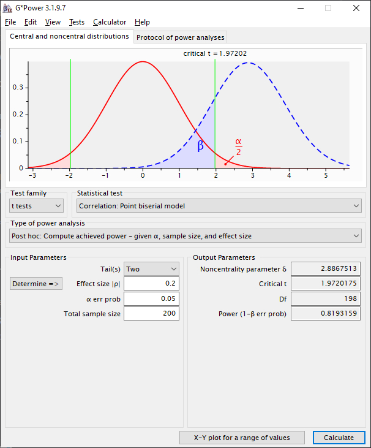

```{r, include = FALSE}
knitr::opts_chunk$set(
  collapse = TRUE,
  comment = "#>"
)
```

```{r setup, include=FALSE}
knitr::opts_chunk$set(echo = TRUE, tidy = FALSE)
options(width = 80)
library("knitr", "rmarkdown", "rmcorr") #, "stats")
require(knitr)
require(rmarkdown)
require(rmcorr)
```
## Frequently Asked Questions 

### How to Calculate Power
Power can be calculated using the *power.rmcorr* function. This function 
modifies pwr.r.test from the <a href="https://CRAN.R-project.org/package=pwr">pwr</a> 
package to use the rmcorr degrees of freedom. It is not presently included in 
the rmcorr package. 

Notation: *N* is the sample size, *k* is the (average) number of repeated measures for each individual, and *r*<sub>*rm*</sub> is the rmcorr effect size.

#### power.rmcorr Example
*N* = 100, *k* = 3, and *r*<sub>*rm*</sub> = 0.20. This design has 82\% power.

```
install.packages("pwr")
require(pwr)

power.rmcorr <- function(k, N, effectsizer, sig)
    {pwr.r.test(n = ((N)*(k-1))+1, r = effectsizer, sig.level = sig)}
    
power.rmcorr(k = 3, N = 100, effectsizer = 0.20, sig = 0.05)    
#> 
#>      approximate correlation power calculation (arctangh transformation) 
#> 
#>               n = 201
#>               r = 0.2
#>       sig.level = 0.05
#>           power = 0.8156984
#>     alternative = two.sided
```

See [Power curves](./New_rmcorr_paper_analyses_figures.html#power) for more information. 

For G\*Power [@faul_statistical_2009] or other software, power can be calculated by substituting the rmcorr degrees of freedom for a Pearson correlation. Instead of sample size, use the degrees of freedom for rmcorr plus two (effective sample size). This is because a Pearson correlation has *N* - 2 degrees of freedom.<br>


- Rmcorr exact degrees of freedom = *N* x (*k* - 1) - 1 <br>
- Approximate degrees of freedom = (*N* -1) x (*k* - 1)  <br>

#### Exact Degrees of Freedom Example
Values: *N* = 100, *k* = 3 , and *r*<sub>*rm*</sub> = 0.20 (same as above) <br> 
rmcorr df = 100 x (3 - 1) - 1 = 200 - 1 = 199 <br>
Add two (kludge): 199 + 2 = 201 <br>
Enter *N* = 201 as the effective sample size in G\*Power <br>
G\*Power will calculate the degrees of freedom as *N* - 2 = 201 - 2 = 199. 
Thus, using the correct degrees of freedom for rmcorr.
<br>

*Note* power is just slighty different than the same calculation in R, which uses an arctan approximation.


#### Approximate Degrees of Freedom Example
Values: *N* = 100, *k* = 3, and *r*<sub>*rm*</sub> = 0.20 (again, same as above) <br>
approx rmcorr df = (100 - 1) x (3 - 1) = 99 x 2 = 198 <br>
Note the small difference between the approximate vs. exact calculation: *one* degree of freedom <br>
Add two (same kludge) for G\*Power, entering a sample size of *N* = 200 <br>

*Note* power is slighty different than the exact formula above. 



### How to Extract the Slope and its Confidence Interval
```{r}
my.rmc <- rmcorr(participant = Subject, measure1 = PaCO2, measure2 = pH, 
                 dataset = bland1995)
 
# Structure of rmcorr object
#str(my.rmc)
 
# Extract rmcorr model coefficients
coef.rmc  <- my.rmc$model$coefficients
coef.rmc
 
slope.rmc <- coef.rmc[length(coef.rmc)] #Last value in coefficients is the slope
slope.rmc
 
# Confidence intervals around all estimates
coef.CIs <- stats::confint(my.rmc$model) 
coefs.all <- cbind(coef.rmc, coef.CIs)
coefs.all
```

### isa Error

We have had reports of this error when running rmcorr: <br>
```
Error in isa(Participant, "character") : could not find function "isa" 
```

<a href="https://stackoverflow.com/questions/73146762/how-to-solve-the-following-error-running-rmcorr-in-r-error-in-isaparticipant">Stack Question with error</a>

Updating R to version 4.1.0 or later resolves this error. <br>


### Transformations
Transformations can be used to make the data (errors) more normal. We highly recommend graphing both the raw and transformed data. It may be appropriate to only transform one measure or transform both measures. "Consider transforming every variable in sight" [@gelman2007, p. 548].

## Limitations 

### Change Over Time 
In general, rmcorr is a time-independent model-- it does not model change over time. A partial
exception is if time is a measure, such as age in the raz2005 dataset.
<br>

### Non-Linearity
Rmcorr fits a linear model. If the data are non-linear, we recommend trying to transform it (see above) or using multilevel modeling. Also see [Diagnostic Plots](./model_diag.html)

### Varying Slopes with Influential Observations and/or Unbalanced Data
If slopes meaningfully vary by individual, we recommend using multilevel modeling instead of rmcorr.
Random effect slopes are even more problematic for rmcorr with influential observations
and/or highly unbalanced data. This is nicely illustrated in simulations by Dr. Marta Karas: 
<br>
<a href="https://martakarass.github.io/post/2022-04-27-rmcorr_vs_lmm/">When rmcorr may not be ideal</a> 

## Other Implementations of rmcorr
We know of three other implementations of rmcorr.

### 1) rmcorrShiny: Web and Standalone App with a Graphical Interface [@marusich2021rmcorrshiny]
- <a href="https://lmarusich.shinyapps.io/shiny_rmcorr/">Web App</a>
- <a href="https://github.com/lmarusich/rmcorrShiny">Shiny Source Code and Running the Standalone App</a> 

### 2) Python: rm_corr in Pingouin [@vallat2018pingouin]
- <a href="https://pingouin-stats.org/generated/pingouin.rm_corr.html#pingouin.rm_corr">rm_corr</a>

### 3) Stata: RMCORR [@stata.rmcorr]
- <a href="https://ideas.repec.org/c/boc/bocode/s458971.html">RMCORR</a>